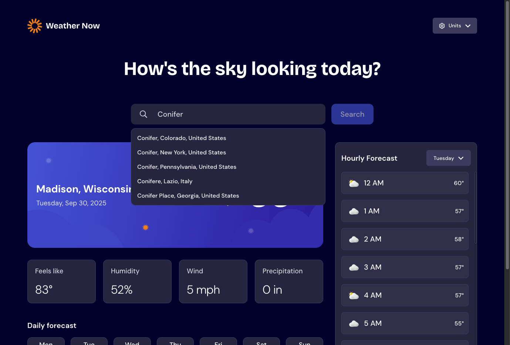

# Frontend Mentor - Weather app solution

This is a solution to the [Weather app challenge on Frontend Mentor](https://www.frontendmentor.io/challenges/weather-app-K1FhddVm49). Frontend Mentor challenges help you improve your coding skills by building realistic projects.

## Table of contents

- [Overview](#overview)
  - [The challenge](#the-challenge)
  - [Screenshot](#screenshot)
  - [Links](#links)
- [My process](#my-process)
  - [Built with](#built-with)
  - [What I learned](#what-i-learned)
  - [Continued development](#continued-development)
  - [Useful resources](#useful-resources)
- [Author](#author)

## Overview

### The challenge

Users should be able to:

- Search for weather information by entering a location in the search bar
- View current weather conditions including temperature, weather icon, and location details
- See additional weather metrics like "feels like" temperature, humidity percentage, wind speed, and precipitation amounts
- Browse a 7-day weather forecast with daily high/low temperatures and weather icons
- View an hourly forecast showing temperature changes throughout the day
- Switch between different days of the week using the day selector in the hourly forecast section
- Toggle between Imperial and Metric measurement units via the units dropdown
- Switch between specific temperature units (Celsius and Fahrenheit) and measurement units for wind speed (km/h and mph) and precipitation (millimeters) via the units dropdown
- View the optimal layout for the interface depending on their device's screen size
- See hover and focus states for all interactive elements on the page

### Screenshot



### Links

- Solution URL: [fem-weather-app](https://github.com/ClaytonDewey/fem-weather-app)
- Live Site URL: [https://claytondewey.github.io/fem-weather-app](https://claytondewey.github.io/fem-weather-app)

## My process

### Built with

- Semantic HTML5 markup
- CSS custom properties
- Flexbox
- CSS Grid
- Mobile-first workflow
- [React](https://reactjs.org/) - JS library
- [TanStack Query](https://tanstack.com/query/latest)

### What I learned

This was my first time building a custom hook. I use this for storing/retrieving the user's selected city as well as unit preferences (metric or imperial).

```js
import { useState, useEffect } from 'react';

function useLocalStorage(key, initialValue) {
  // State to store our value
  // Pass initial state function to useState so logic is only executed once
  const [storedValue, setStoredValue] = useState(() => {
    try {
      // Get from local storage by key
      const item = window.localStorage.getItem(key);
      // Parse stored json or if none return initialValue
      return item ? JSON.parse(item) : initialValue;
    } catch (error) {
      // If error, return initialValue
      console.error(error);
      return initialValue;
    }
  });

  // useEffect to update local storage when the state changes
  useEffect(() => {
    try {
      window.localStorage.setItem(key, JSON.stringify(storedValue));
    } catch (error) {
      console.error(error);
    }
  }, [key, storedValue]);

  return [storedValue, setStoredValue];
}

export default useLocalStorage;
```

### Continued development

Eventually I would like to look into using the browser Geolocation API to load local weather (if user gives permission).

### Useful resources

- [TanStack Query Dock](https://tanstack.com/query/latest/docs/framework/react/overview) - Helped me build the location and weather search queries.

## Author

- Website - [Clayton Dewey](https://www.claytondewey.com)
- Frontend Mentor - [@ClaytonDewey](https://www.frontendmentor.io/profile/ClaytonDewey)
